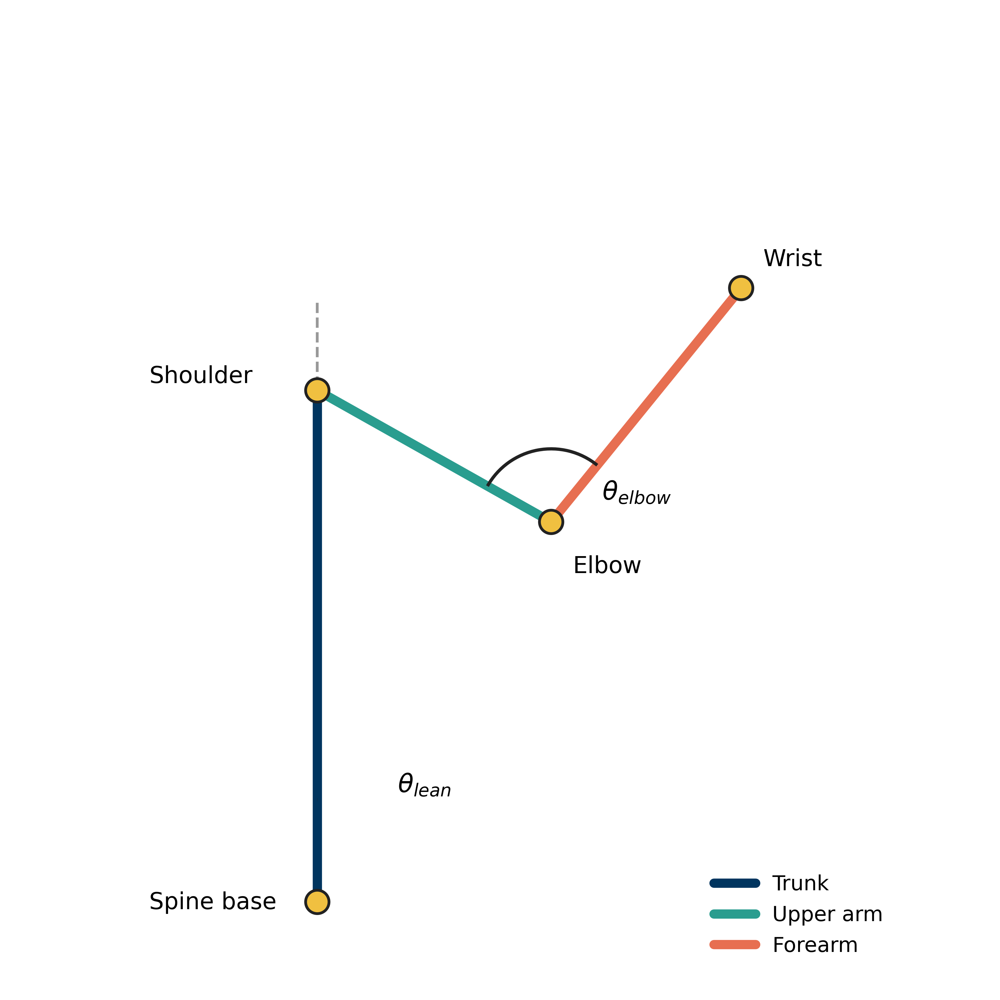

# Adaptive Motor Re-Learning: A Wearable Sensor Framework for Upper-Limb Stroke Rehabilitation

**Peter Ohue¹, Gunnar Blohm¹,²**

¹Centre for Neuroscience Studies, Queen's University, Kingston, ON, Canada
²Department of Biomedical and Molecular Sciences, Queen's University, Kingston, ON, Canada

*Draft: Phase 1 (Abstract / Introduction / Methodology). Results and Discussion to follow in later phases per author's iterative writeup process.*

---

## Abstract

*[To be completed once Results are finalized. Target ~200 words summarizing motivation, approach (RL reference trajectories + TRSP comparison + wearable sleeve concept), and key contribution.]*

---

---

## Introduction

Stroke disrupts blood flow to the brain. It affects more than 13 million people worldwide, kills more than 5 million people annually, and is a leading cause of long-term disability [@Lu2012; @Kuriakose2020]. Motor deficits are a major neurological consequence of stroke and are associated with loss of independence and reduced quality of life [@Lucchetti2025]. Accurate diagnosis of the resulting physical impairment, including changes in function of the affected limb, is a prerequisite for recommending appropriate remediation [@Gowland1993; @Mehrholz2015].

Normal upper-limb function during daily-life tasks depends on coordinated shoulder-arm kinematics and muscular synergies across at least 30 common activities, with hand postural synergies contributing substantially to grasp force [@Hu2018; @Averta2018; @Saudabayev2018]. Linking forearm muscle activity to hand kinematics is central to prosthetic design and 3-D biomechanical modelling [@JarqueBou2019]; the same coordination is what stroke-related motor deficits disrupt.

When normal coordination is lost, stroke survivors often compensate by recruiting alternative movement pathways and unaffected joints and muscles, a substitution that can be inefficient and reinforce atypical movement patterns [@Dolatabadi2017]. Rehabilitation devices delivered to patients are frequently abandoned after delivery; abandonment is driven by a poor fit between the device and the user's actual needs, insufficient user involvement in device selection, and lack of ongoing support once the device is at home [@Sugawara2018]. Robotic and electromechanical devices carry the same risk, and their cost and clinic-based delivery model make sustained home use harder [@Mehrholz2015]. An upper-limb rehabilitation device should therefore be low-cost and open-hardware, so it can reach the home and the community clinic rather than only the specialized centre, and adaptive, so it can flag emerging compensation in real time rather than depend only on intermittent clinical supervision.

Home-based use of these devices needs supervision, because unmonitored recruitment of unaffected muscles and joints often leads to undesirable outcomes [@Zhi2018]. To characterize these compensations, prior work has simulated three types with healthy participants: forward trunk lean, trunk rotation, and shoulder elevation [@Zhi2018; @Dolatabadi2017]. When post-stroke survivors instead follow homework-based rehabilitation programs without this supervision, new and undesirable compensation patterns risk developing, making later unlearning and relearning necessary [@Lin2019]. Rehabilitation programs should include task-specific training to induce plasticity and motor recovery; individualized strategies have been useful in identifying relevant therapeutic goals and maximizing long-term gain [@Takeuchi2013].

In this study, our goal is to develop a rehabilitation framework for upper-limb post-stroke management that is usable outside the specialized clinic. We compare RL-generated reference trajectories against the reach kinematics of healthy participants (performing natural and simulated-compensation reaches) and post-stroke participants, to quantify compensation strategies rather than rely on visual inspection alone. This framework builds on a companion computational study relating RL-derived internal representations to internal representations in biological neurons during motor adaptation [@Ohue2026], and on our earlier work on accessible computational-neuroscience tools and training [@Chinagorom2025; @OhuePythonUnpub]. We further propose an adaptive motor-relearning program built around a neuroinspired wearable sleeve, pairing open-source RL control software with a low-cost, open-hardware design, so stroke survivors can receive continuous, condition-specific feedback while relearning natural movement.

---

## Methodology

We developed an open-source Proximal Policy Optimization (PPO) model, a reinforcement-learning control algorithm, to simulate how human arms adapt and navigate obstacles under unexpected physical disruptions [@Schulman2017]. This work is currently undergoing internal review for publication [@Ohue2026].

### Project vision

1. An open-access RL motor-control framework (PPO agent) modeling sensorimotor adaptation, obstacle avoidance, and unlearning/relearning dynamics during stroke recovery.
2. A low-cost, open-spec motorized arm sleeve designed for home recovery and community clinics, as an open-source alternative to expensive proprietary devices.
3. Extending our open-source AI models to lower-limb assistive devices to reduce device abandonment and support natural gait dynamics.

### RL reference trajectories

The RL controller is a PPO actor-critic agent trained in a 2-D point-mass reaching environment under Newtonian dynamics. Its state $\mathbf{s}_t = (x_t, y_t, \dot{x}_t, \dot{y}_t)$ evolves under

$$
\dot{\mathbf{s}}_t = f(\mathbf{s}_t, \mathbf{a}_t) = \begin{bmatrix} \dot{x}_t \\ \dot{y}_t \\ \tfrac{1}{m}\left(F_x(\mathbf{a}_t) + F_x^{\text{pert}}(t)\right) \\ \tfrac{1}{m}\left(F_y(\mathbf{a}_t) + F_y^{\text{pert}}(t)\right) \end{bmatrix},
$$

where $\mathbf{a}_t$ is the policy's continuous control action, $m$ is the point-mass, and $F^{\text{pert}}(t)$ is a graded lateral force impulse applied during a fixed perturbation window. Policy and value networks are two-hidden-layer (256-unit) feedforward networks, trained with the clipped PPO surrogate objective

$$
L^{\text{CLIP}}(\theta) = \hat{\mathbb{E}}_t\left[\min\left(r_t(\theta)\hat{A}_t,\ \text{clip}(r_t(\theta), 1-\epsilon, 1+\epsilon)\hat{A}_t\right)\right], \qquad r_t(\theta) = \frac{\pi_\theta(\mathbf{a}_t\mid \mathbf{s}_t)}{\pi_{\theta_{\text{old}}}(\mathbf{a}_t\mid \mathbf{s}_t)}.
$$

We treat the trained policy's rollouts under each perturbation condition (P0 control; L1–L3, R1–R3 graded lateral perturbations) as reference trajectories: task-optimal movement paths, unconstrained by anatomy, against which human reach geometry can be compared for compensation.

### Human reach-kinematics data

We use the Toronto Rehab Stroke Pose (TRSP) dataset [@Dolatabadi2017; @Zhi2018]. It contains Kinect-derived 3-D joint-position time series (25-joint skeleton) for:

- 10 healthy participants (H01–H10), each performing standardized forward/backward and side-to-side reaches under a natural condition and under three simulated compensations: forward trunk lean (`LnFwr`), shoulder elevation (`ShElev`), and trunk rotation (`TrRot`), left and right (`_L`/`_R`).
- 9 post-stroke participants (P01–P09) performing the same reach tasks without an instructed compensation strategy.

Each trial directory contains `Joint_Positions.csv` (25 joints x 3 coordinates, stacked frame by frame) and `Labels.csv` (one label per frame). The file schema is documented in `data/raw/README.md`.

### Trajectory alignment and compensation quantification

Human wrist trajectories are projected onto their own 2-D reach plane by PCA, resampled to a common time base, and rigidly aligned (translation + uniform scale) to the matching RL reference trajectory. We report a path-length ratio and the mean/max lateral deviation between the two. Three compensation features are computed per frame directly from the joint data: forward lean angle, trunk rotation angle, and shoulder elevation, following the compensation categories used to build the TRSP dataset [@Zhi2018]. This pipeline is implemented in `src/clinical/` (`trsp_loader.py`, `compensation_metrics.py`, `trajectory_alignment.py`, `rl_reference.py`). `scripts/export_rl_reference.py` averages trained-policy rollouts (from `scripts/evaluate.py`) into a canonical reference path per perturbation condition, and `scripts/compare_rl_vs_trsp.py` / `scripts/batch_compare_rl_vs_trsp.py` run the single-trial and full-dataset comparison against that reference (falling back to a straight-line placeholder until a policy has been trained).

### Wearable sensor framework

We propose a motorized arm sleeve with three inertial measurement units (trunk, upper arm, forearm) to estimate the same three compensation features outside the lab, in real time. Sensor angles are compared continuously against the RL reference trajectory for the matching reach task; a deviation beyond a clinician-set tolerance triggers feedback. This extends the real-time visual-feedback approach shown to reduce compensatory motion in home-based exercise [@Lin2019] to a model-based, condition-specific reference rather than a single fixed target. The proposed sensor set, microcontroller choice, and validation plan are detailed in `docs/wearable_sleeve_hardware.md`.

---

## Results

*[Phase 2: numbers below are pending a full RL training run. Do not fill in placeholder/smoke-test numbers as findings.]*

Once `scripts/train.py` has been run to convergence (`configs/training.yaml`: 3,000,000 timesteps) and `scripts/export_rl_reference.py` has exported a real reference trajectory for each perturbation condition, `scripts/batch_compare_rl_vs_trsp.py` produces one row per TRSP trial (149 trials: 10 healthy x up to 12 tasks, 9 post-stroke x variable repeated trials) in `data/processed/rl_vs_trsp_summary.csv`, with:

- `path_length_ratio`, `mean_lateral_deviation`, `max_lateral_deviation` per trial, comparing the projected wrist path against the matching RL reference condition.
- `mean_lean_deg`, `mean_trunk_rot_deg`, `mean_shoulder_elev` per trial, from `compensation_metrics.py`.

This section will report: (1) path-length ratio and lateral deviation for healthy natural-reach trials vs. the P0 (unperturbed) RL reference, establishing a baseline; (2) the same metrics for healthy simulated-compensation trials (`LnFwr`, `ShElev`, `TrRot`), to confirm the pipeline detects known, instructed compensations as larger deviations than the natural-reach baseline; (3) the same metrics for post-stroke trials, to test whether uninstructed compensation in this group falls closer to the simulated-compensation range than to the healthy-natural range; and (4) whether comparing against graded perturbation conditions (L1-L3, R1-R3) rather than only P0 changes the group separation.

## Discussion

*[Phase 2: to be added, once Results are populated with a real training run.]*

## Acknowledgements

This work was supported in part by the Connected Minds Program, Canada First Research Excellence Fund, Grant No. CFREF-2022-00010.

## References

See `paper/references.bib`.
